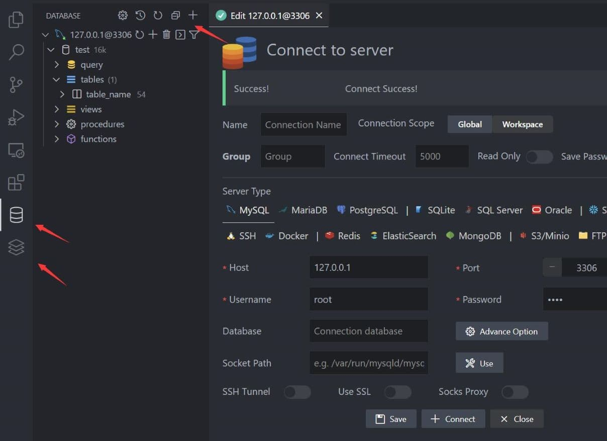
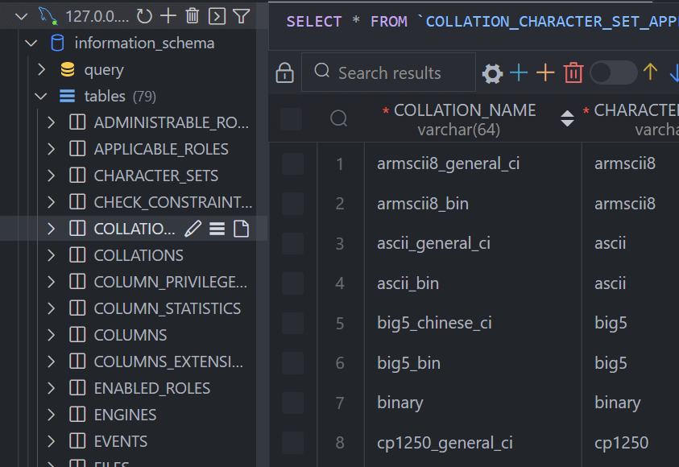
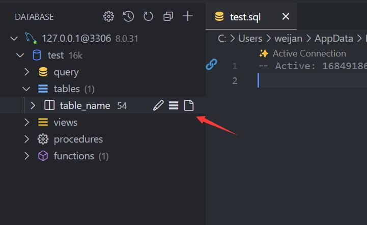
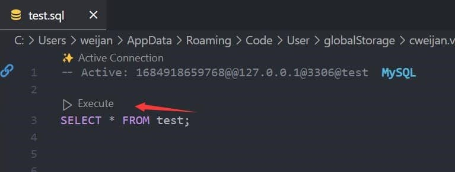

# QuickStart

## Connect

1. Open Database Explorer panel, then click the `+` button.
2. Select your server type, input connection config then click the connect button.

This extension will create two panels, because in some cases it is necessary to view both SQL and NoSQL data.

If you don't need nosql, you can drag it by long press.

### View

1. Clicking on the data table node in the tree view will open the data view.
2. Then you can do data modification on the data view.
3. The total number of data is displayed next to the table, which is not accurate, but can be used to determine the data volume level of the table.

## Execute SQL

In the Database Explorer panel, click the `Open Query` button.

That will open a SQL editor bind of database, it provider:

1. IntelliSense SQL edit.
2. snippets:`sel、del、ins、upd、joi, selc`...
3. Run selected or current cursor SQL (Shortcut : Ctrl+Enter).
4. Run all SQL (Shortcut : Ctrl+Shift+Enter).

You can reverse the data by adding \G at the end of the SQL.

## Design

There are two ways to modify table meta information

1. Right-click on the table, select Design Table, you can open the design table interface to view the columns and indexes of the table (currently only MySQL has high support)
2. Expand the table node directly, click the column node and edit it directly by SQL.

## Backup/Import

### SQL

Right-click on a table or database node, and you can backup and restore data through the menu.

The extension has a built-in backup function, but it is not perfect. When your environment variable has **mysql_dump** or **pg_dump**, the extension will use These tools make backups.

### Redis

Since version 5.0, Redis backup and restore is supported, and two formats JSON and NDJSON are available, NDJSON recommended for large data.

