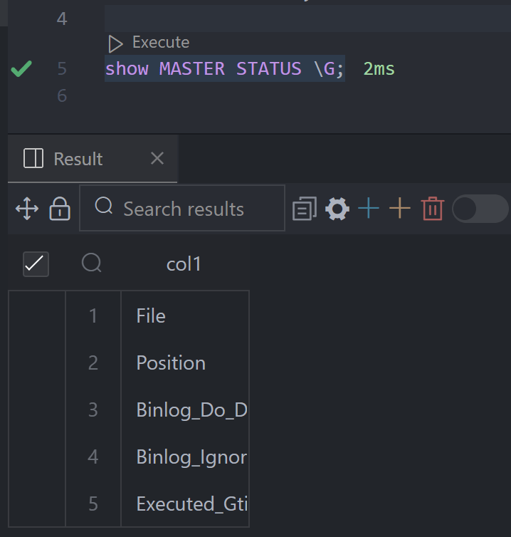
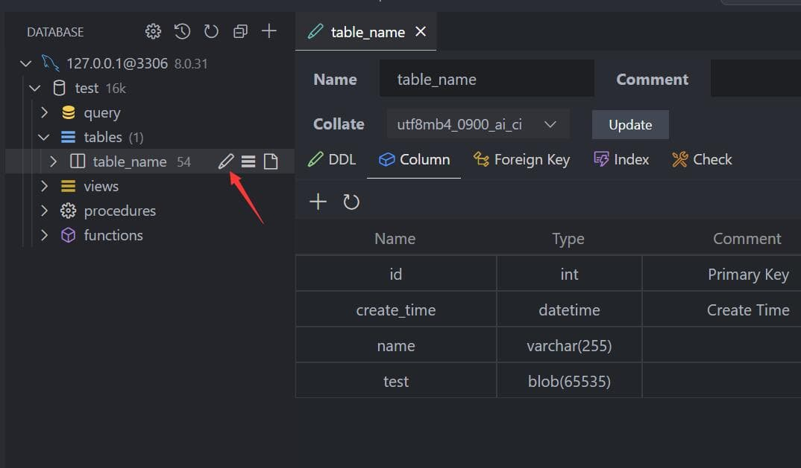

# 快速开始

## 连接

1. 打开左侧数据库面板, 点击添加按钮
2. 在连接页面配置相应的服务器信息

这个扩展将创建两个面板, 因为部分情况下需要同时查看SQL和NoSQL的数据. 可通过长按拖动面板到另一个里面.

### 浏览

1. 在树形视图中点击数据表节点, 就会打开数据视图.
2. 之后可在数据视图进行CRUD、数据导出等操作.
3. 表旁边会显示数据总数, 不是准确的, 但可以用来确定表的数据量级别.

## 执行SQL

点击数据库节点的 `Open Query` 按钮.

将会打开和当前数据库绑定的SQL编辑器, 提供以下功能

1. SQL自动补全.
2. snippets: `sel、del、ins、upd、joi, selc.`
3. 执行已选择或当前光标SQL (快捷键: Ctrl+Enter).
4. 执行全部SQL (快捷键: Ctrl+Shift+Enter).

可通过在SQL结尾拼接\G反转数据.

## 设计表

修改表元信息有两种做法

1. 对表右键, 选择Design Table(设计表), 就可打开设计表界面查看表的列和索引 (目前只有MySQL得到较高的支持)
2. 直接展开表节点, 点击列节点后通过SQL直接编辑.

## 备份/恢复

### SQL

在表或者数据库节点右击, 就可通过菜单进行数据的备份恢复. 扩展内置了备份功能, 但不够完善, 当你的环境变量具有**mysql_dump**或**pg_dump**, 扩展将会使用这些工具进行备份.

### Redis

从版本5.0开始支持对Redis进行备份和恢复, 可选两种格式JSON和NDJSON(推荐用于数据量大的情况)

